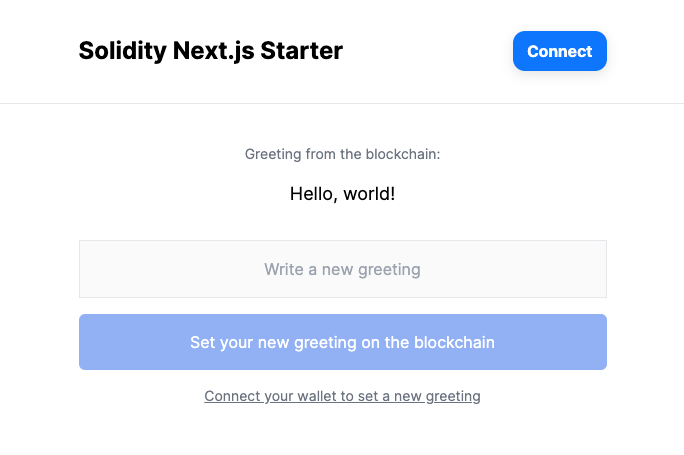

# Solidity Next.js Starter

A starter repository for building full stack Ethereum dApps with [Solidity](https://soliditylang.org/) and [Next.js](https://nextjs.org/).

This code is for anyone looking to quickly bootstrap an EVM dApp using modern best practices. In particular, developers with existing JavaScript/TypeScript experience who're newer to Solidity.

If you want to learn how to interact with a simple smart contract from the client side, this repository is for you.



- [Get started](#getting-started)
- [Read changelog](./CHANGELOG.md)

## Packages

### Contracts

`packages/contracts` - All smart contract files.

#### Contracts Stack

- [Alchemy](https://www.alchemy.com/)
- [Hardhat](https://hardhat.org/)
- [Mocha](https://mochajs.org/)
- [Chai](https://www.chaijs.com/)
- [Solidity](https://soliditylang.org/)
- [TypeScript](https://www.typescriptlang.org/)
- [Prettier](https://prettier.io/)

#### Contracts Scripts

- `yarn start` - Starts your local Hardhat network
- `yarn test` - Tests `Greeter.sol`'s functionality
- `yarn deploy` - Deploys `Greeter.sol` to your local Hardhat network
- `yarn deploy:goerli` - Deploys `Greeter.sol` to the Goerli test network
- `yarn format` - Formats all code using Prettier

### App

`packages/app` - All client application files.

#### App Stack

- [Alchemy](https://www.alchemy.com/)
- [Next.js](https://nextjs.org/)
- [Tailwind CSS](https://tailwindcss.com/)
- [viem](https://viem.sh/)
- [wagmi](https://wagmi.sh/)
- [RainbowKit](https://www.rainbowkit.com/)
- [TypeScript](https://www.typescriptlang.org/)
- [Prettier](https://prettier.io/)

#### App Scripts

- `yarn dev` - Starts the Next.js local development environment
- `yarn build` - Creates an optimised production build of your app
- `yarn start` - Starts the Next.js application in production mode
- `yarn lint` - Checks for problems in your code using ESLint
- `yarn format` - Formats all code using Prettier

## Prerequisites

- [Node](https://nodejs.org/en/download/)
- [MetaMask](https://metamask.io/download.html)

## Getting Started

How to get running on your local machine:

### Initial Setup

Use `git clone git clone https://github.com/tomhirst/solidity-nextjs-starter.git` to clone this repository to your local machine.

Enter the repository folder with `cd solidity-nextjs-starter`, then install all dependencies using `yarn`.

Solidity Next.js Starter uses Yarn workspaces, so this will install the relevant dependencies for each packages in one command.

### Contracts Setup

Enter the `contracts` folder with `cd packages/contracts` and start your local hardhat node with `yarn start`. If you're successful, you'll be presented with a number of accounts (one of which you'll need later). Here's an example:

```bash
Account #0: 0xf39Fd6e51aad88F6F4ce6aB8827279cffFb92266 (10000 ETH)
Private Key: 0xac0974bec39a17e36ba4a6b4d238ff944bacb478cbed5efcae784d7bf4f2ff80
```

In a new terminal window, deploy the `Greeter` contract using `yarn deploy`. If you're successful, you'll get a contract address (that you'll also need later) like this:

```bash
Greeter with greeting "Hello, world!" deployed to 0x5FbDB2315678afecb367f032d93F642f64180aa3
```

### App Setup

Enter the `app` folder with `cd packages/app` from the root directory.

You'll need a RainbowKit project ID. You can get one from [WalletConnect Cloud](https://cloud.walletconnect.com/) and it will look something like this: `206a512b7abd9c469123b45fb272b68e` (not a real key).

Afterwards, duplicate `.env.example` and rename the file `.env`. Then add your RainbowKit project ID like this: `NEXT_PUBLIC_RAINBOWKIT_PROJECT_ID=[your key]`.

`NEXT_PUBLIC_CHAIN_ID` should already be set to the Hardhat local network ID of `31337` (change this when you want your app to run on other chains).

Finally, set `NEXT_PUBLIC_CONTRACT_ADDRESS` using the contract address you recieved when you deployed. For example: `NEXT_PUBLIC_CONTRACT_ADDRESS=0x5FbDB2315678afecb367f032d93F642f64180aa3`

Once your environment variables are set, run the application using `yarn dev`. To view, open up `localhost:3000` (or whatever port Next.js has assigned) in your browser.

### MetaMask Setup

To fully demo the apps' features, you'll need a web3 wallet extension. If you don't have MetaMask installed already, you can get it [here](https://metamask.io/download.html).

If you haven't used Hardhat before, you'll need to add a test account to write to the smart contract that you deployed. Do this by importing one of the accounts you noted down earlier to MetaMask using the accounts' private key (for example, `0xac0974bec39a17e36ba4a6b4d238ff944bacb478cbed5efcae784d7bf4f2ff80`).

Once connected to the app with the test account, you can set a new greeting on the blockchain by using the form on page. You'll get a confirmation message if you're successful.

## Advanced

Instructions for deploying the smart contract and application to publically viewable environments:

### Advanced Contracts

Up to now, your smart contract has been running locally. The next step is to deploy it to a live test network. We'll use [Goerli](https://goerli.net/) for this.

#### Deploying to Goerli Testnet

First you need some Goerli test ETH. You can get some from a [Goerli Faucet](https://goerlifaucet.com/).

In the `packages/contracts` directory, duplicate `.env.example` to `.env`. You'll need an [Alchemy API key](https://docs.alchemy.com/docs/alchemy-quickstart-guide#1key-create-an-alchemy-key) and the private key of the wallet you'd like to deploy your Goerli contract from. I recommend using a burner account that doesn't hold any valuable assets on other chains.

Set the environment variables like so:

```bash
ALCHEMY_API_KEY=[your-api-key]
GOERLI_PRIVATE_KEY=[your-private-key]
```

Finally, run `yarn deploy:goerli`. If you're successful, you'll get a message ike this in your terminal window:

```bash

```

Here's a version of the contract I deployed earlier: []()

#### Verifying Your Contract on Goerli

Let's verify your newly deployed contract with Etherscan. Get an Etherscan API here. Add it to the env. Run script.

How to deploy your smart contract to Goerli testnet and application to Vercel:

### App

#### Adding an Alchemy API Key

To read smart contracts on a testnet or mainnet, you'll need an Alchemy API key. You can get one [here](https://docs.alchemy.com/docs/alchemy-quickstart-guide#1key-create-an-alchemy-key):

#### Deploying to Vercel

Here's an app I deployed earlier.

## Contributions

All suggestions for improvement are welcome. Please submit a [pull request](https://github.com/tomhirst/solidity-nextjs-starter/pulls) to contribute.

## Disclaimer

All code in this repository is unaudited. Use at your own risk.
